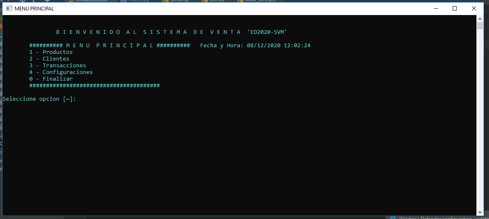

# Sistema de Ventas MiniMarket  "ED2020-SVM"

ED2020 es un sistema de control para caja en el rubro de comercio y afines esta desarrollado en c++ usando pilas, colas y listas enlazadas.

# Nuevas caracteristicas!

  - Esta integrado con ficheros de texto
  - Cuenta con login de inicio ofuscado y tres intentos

Puede agregar:
  - Usuarios por roles para privilegios de configuración
  - Integrar libreria para exportar reportes en csv y luego a Excel
  - Agregar Kardex al inventario o costo ABC

### Instalación

ED2020 requiere del compilador si en caso usa Windows [C++](https://sourceforge.net/projects/mingw/files/)  o en caso de Linux [C++](https://linuxconfig.org/how-to-install-g-the-c-compiler-on-ubuntu-18-04-bionic-beaver-linux)  puede seguir esos pasos.

### Desarrollo

Como empezar a desarrollar?

Para desarrollar ED2020 se recomienda las siguientes herramientas:

* IDE CLion 
* MinGW g++ para Windows o Linux (Depende del sistema operativo que usas)
* Windows 7/8/10
* Linux Ubuntu 16 LTS a +

License
----

MIT

